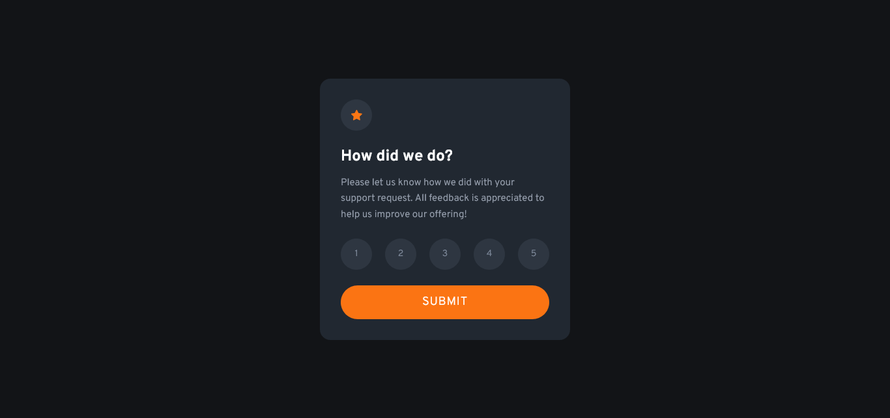
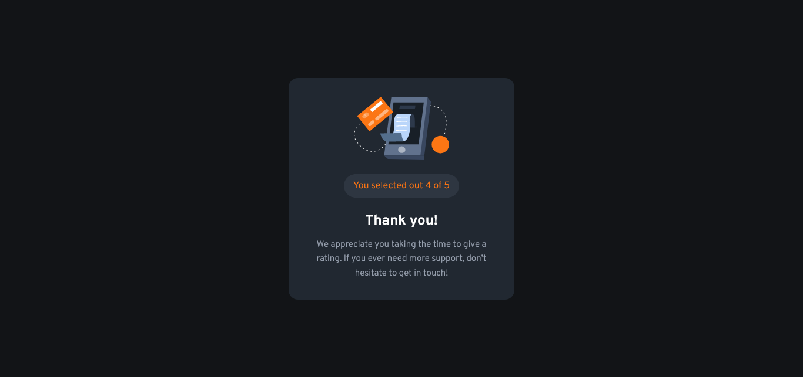

# Frontend Mentor - Interactive Rating Component solution

This is a solution to the [Interactive rating component challenge on Frontend Mentor](https://www.frontendmentor.io/challenges/interactive-rating-component-koxpeBUmI). Frontend Mentor challenges help you improve your coding skills by building realistic projects.

## Table of contents

- [Frontend Mentor - Interactive Rating Component solution](#frontend-mentor---interactive-rating-component-solution)
  - [Table of contents](#table-of-contents)
  - [Overview](#overview)
    - [The challenge](#the-challenge)
    - [Screenshot](#screenshot)
    - [Links](#links)
  - [My process](#my-process)
    - [Built with](#built-with)
    - [Continued development](#continued-development)
  - [Author](#author)

## Overview

### The challenge

Users should be able to:

- View the optimal layout for the app depending on their device's screen size
- See hover states for all interactive elements on the page
- Select and submit a number rating
- See the "Thank you" card state after submitting a rating

### Screenshot

### Links

- Solution URL: [To be added](https://your-solution-url.com)
- Live Site URL: [Deployed on Vercel](https://interactive-rating-component-wheat.vercel.app/)

## My process

### Built with

- [Svelte](https://svelte.dev/) + TypeScript
- [WindiCSS](https://windicss.org/) + Svelte Transition API
- Mobile-first workflow
- Vite

### Continued development

I'd like to learn more about semantic HTML and accessibility since I have not really focused on them as much as I probably should. But hey, at least I know no accessibility is better than bad accessibility.

## Author

- Frontend Mentor - [@Shawn Lee](https://www.frontendmentor.io/profile/OGShawnLee)
